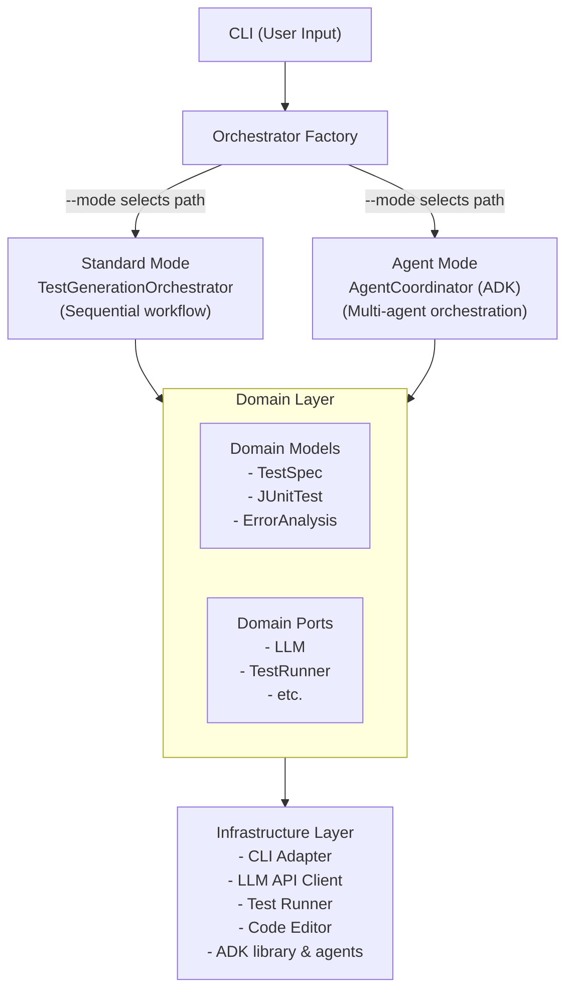
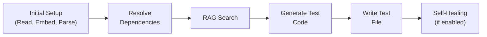
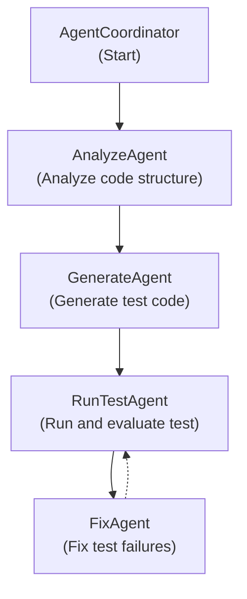
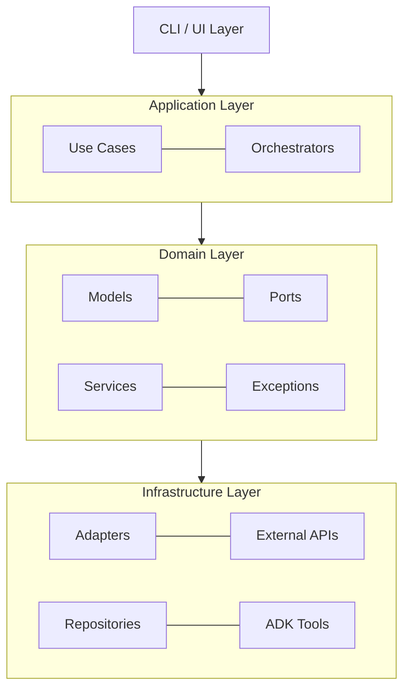
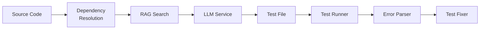
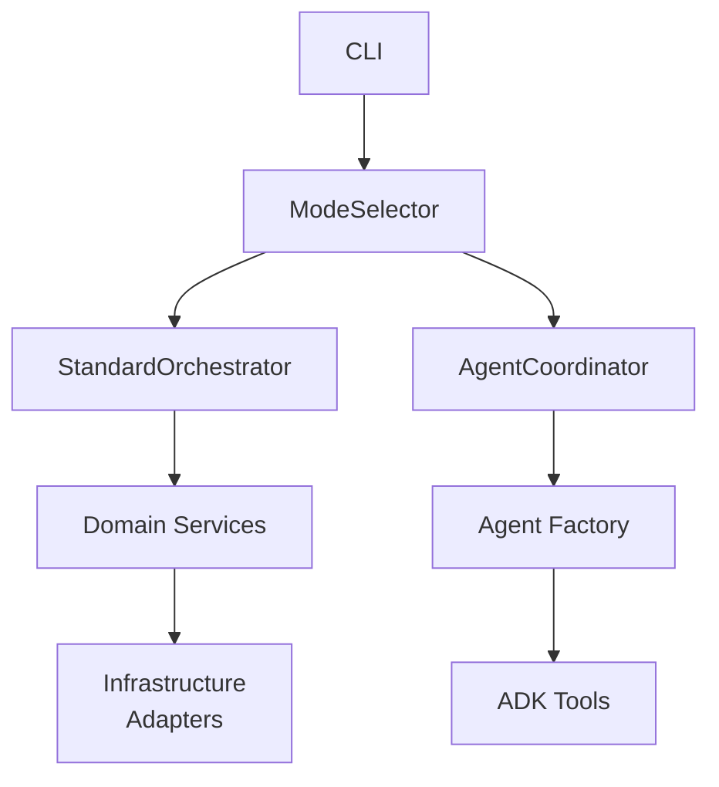

# JUnit Writer Architecture Diagrams (Mermaid)

## High-Level Architecture

## Standard Mode Workflow

## Agent Mode Workflow

## Clean Architecture Layers

## Data Flow Diagram

## Component Interaction Diagram

